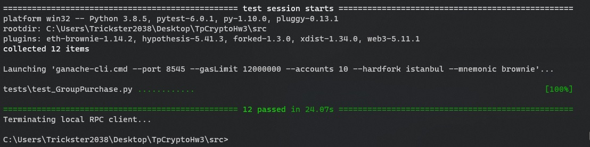

# Group Purchase

Коллективная покупка товара за ETH с произвольных адресов 

> Данный смарт-контракт является реальзацией ДЗ-3 по курсу "Разработчик криптографических протоколов и децентрализованных систем"


## Компиляция и запуск

Для корректной работы тестов необходимо установить python-библиотеку *pytest*
```
$ pip install pytest
```
Затем - перейти в папку исходных кодов проекта 
```
$ cd src
```
Далее - скомпилировать смарт-контракт (версия языка - solidity ^0.8.0)
```
$ brownie compile
```
После чего можно запустить заготовленные тесты
```
$ brownie test
```
Или произвести ручное тестирование через консоль brownie
```
$ brownie console
```

## Концепция 

Смарт-контракт хранит mapping вида (id => покупка), каждая покупка имеет поля: продавец, цена, собранное число денег, флаг активности (позволяет определять свободные id)

Этапы работы смарт-контракта
- пользователь вызывает view-функцию возвращающую наименьший свободный id - *getFreeId()*
- пользователь инициализирует сбор средств на покупку *initPurchase(...)*  и задает ее характеристики (список см. в начале главы)
- пользователи перечисляют средства, пока их не накопится достаточное количество, затем стоимость покупки перечисляется со счета смарт-контракта на счет продавца, сдача перечисляется последнему клиенту/продавцу/владельцу смарт-контракта (зависит от вызванной функции *investTip<...>(...))*

*Хотелось бы добавить функцию возврата денег, но это требует усложнения структуры storage-переменных*

## Результаты тестов



## Файлы проекта

*src/contracts/GroupPurchase.sol* - смарт контракт

*src/tests/test_GroupPurchase.py* - тесты